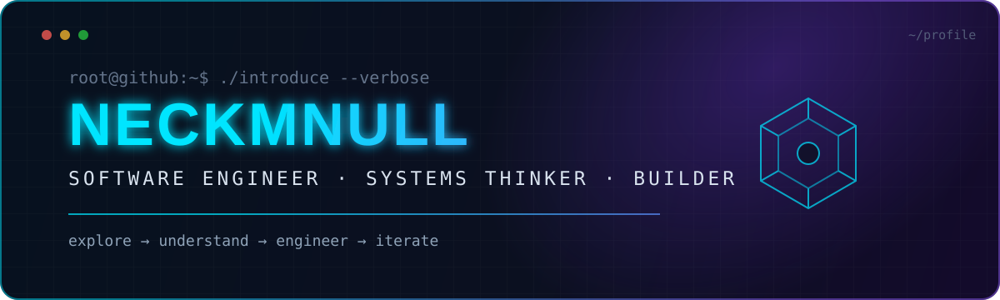

<div align="center">
  
</div>

<div align="center">
  <a href="mailto:neckmnull@gmail.com"></a>
  <a href="https://github.com/neckmnull?tab=repositories"></a>
  
</div>

<br />

```console
$ whoami
neckmnull — a software engineer interested in the whole stack, not just one layer.

$ cat mission.txt
Understand the system. Remove accidental complexity. Ship something useful.
```

## `01. About`

I am a **generalist engineer and creative technologist** who enjoys moving between
product interfaces, backend services, data, infrastructure, and lower-level systems.
I care more about choosing the right abstraction than defending a favorite tool.

- 🧩 I approach products as connected systems: **UX → API → data → delivery**.
- ⚙️ I automate repetitive work and make development environments reproducible.
- 🧠 I explore different languages and paradigms to sharpen how I solve problems.
- 🔍 I value explicit trade-offs, readable code, useful tests, and honest documentation.
- 🤝 I am open to ambitious teams, unusual problems, and engineering conversations.

## `02. Engineering map`

<table>
  <tr>
    <td width="50%" valign="top">
      <h3>◈ Product engineering</h3>
      <p>Accessible interfaces, typed application code, maintainable APIs, authentication, data modeling, and pragmatic testing.</p>
    </td>
    <td width="50%" valign="top">
      <h3>◈ Systems & tooling</h3>
      <p>CLI tools, automation, Linux workflows, containers, observability, performance awareness, and developer experience.</p>
    </td>
  </tr>
  <tr>
    <td width="50%" valign="top">
      <h3>◈ Data & intelligence</h3>
      <p>Data pipelines, relational and document models, search, practical ML integration, and AI-assisted workflows.</p>
    </td>
    <td width="50%" valign="top">
      <h3>◈ Language exploration</h3>
      <p>Object-oriented, functional, concurrent, logic, and systems paradigms—learning ideas that transfer between ecosystems.</p>
    </td>
  </tr>
</table>

## `03. Technology radar`

<div align="center">

**APPLICATIONS**


**SYSTEMS · DATA · DELIVERY**


</div>

> **How to read this section:** it is a technology radar, not a claim of equal
> mastery. Depth comes from building; breadth helps me select and learn the right tool.

## `04. Current signal`

```yaml
focus:
  - building public, reviewable work
  - turning experiments into documented repositories
  - learning across programming paradigms
principles:
  - make invalid states difficult to represent
  - optimize for clarity before cleverness
  - automate the second repetition
  - document decisions, not obvious syntax
status: open to interesting engineering opportunities
```

## `05. Selected laboratory`

<a href="https://github.com/neckmnull/polyglot-lab">
  
</a>

**[Polyglot Lab](https://github.com/neckmnull/polyglot-lab)** is a documented tour
through programming paradigms—from COBOL and Prolog to Elixir, Raku, and Zig. It is a
learning artifact and reproducible reference, not a claim of production expertise in
every language.

## `06. GitHub telemetry`

<div align="center">
  
  
</div>

<div align="center">
  
</div>

---

<div align="center">
  <b>Interesting problem? Let’s compare notes.</b><br /><br />
  <a href="mailto:neckmnull@gmail.com">neckmnull@gmail.com</a>
  <br /><br />
  <sub>Build deliberately · Learn continuously · Leave systems better than you found them</sub>
</div>